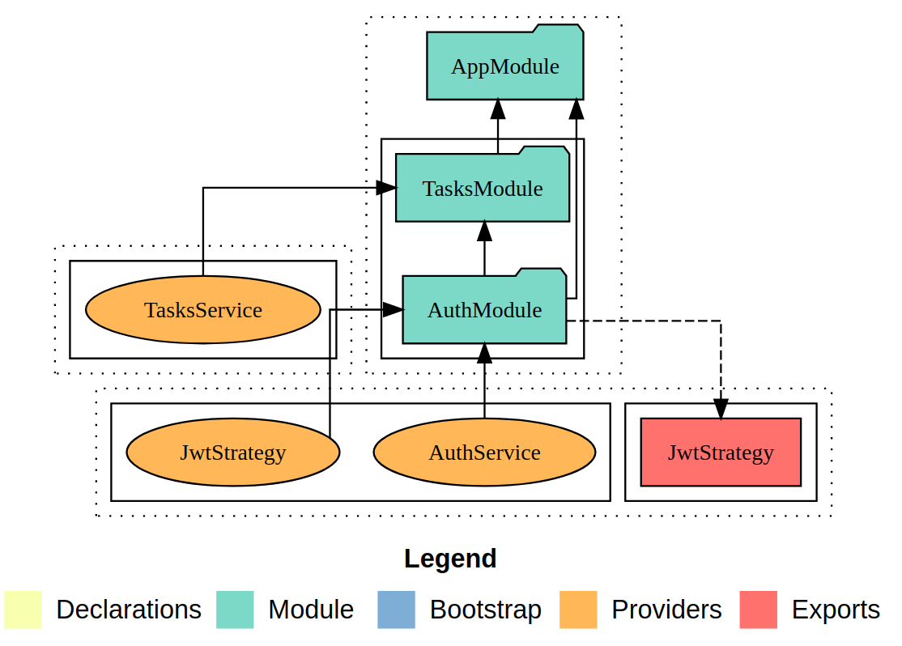

# Task Management

This is a service to manage tasks.

It's necessary to create a user to use the system.
A user can only manage his own tasks.

## Description

A Task has the following attributes:

| Field name  |        Description         |                 Type                  | Default |
| :---------: | :------------------------: | :-----------------------------------: | ------- |
|    title    |        Name of task        |                string                 |         |
| description | Explanation about the task |                string                 |         |
|   status    | Current status of the task | string, enum: OPEN, IN_PROGRESS, DONE | OPEN    |

## Technologies

- [NestJS](http://nestjs.com) a Typescript framework for Node.js
- [Postgres](https://www.postgresql.org) as database
- [Jest](https://jestjs.io) for unit tests
- [JWT](https://jwt.io) for Authentication
- [ESLint](https://eslint.org) and [Prettier](https://prettier.io)
- [Husky](https://github.com/typicode/husky) to force syntax checking before commits

## Highlights

- 100% coverage with unit tests

## Requirements

### For local usage:

- [Node.js](https://nodejs.org) (v14)
- [npm](https://www.npmjs.com)
- [Postgres](https://www.postgresql.org) (v13)

### For local usage with Docker:

- [Docker Engine](https://docs.docker.com/install)
- [Docker Compose](https://docs.docker.com/compose/install)

## Running

### With Docker

- Be sure you have [Docker](https://docs.docker.com/get-docker) and [docker-compose](https://docs.docker.com/compose) installed.

```bash
docker-compose up
```
#### URLs:

- Base URL for API: [http://10.12.0.2:3000](http://10.12.0.2:3000)
- PGAdmin: [http://10.12.0.4](http://10.12.0.4) - Login as **user@domain.com**, password **123456**

#### Application container

```bash
docker exec -it nestjs-tasks bash
```

### Without Docker

- Configure database connection at config/development.yml OR define the envs listed at src/config/typeorm.config.ts.

```bash
$ npm install

# development
$ npm run start

# watch mode
$ npm run start:dev

# production mode
$ npm run start:prod
```

## Usage

Consult the API documentation [available at swagger](https://app.swaggerhub.com/apis-docs/leogomesdev/Task_Management/1.0.0) (OpenAPI 3.0)

### TL;DR

1. Open [Postman application](https://www.postman.com)
2. Import [this collection](docs/NestJS%20Task%20Management.postman_collection.json)
3. Set the Postman Environments (use gear or eye buttons on top right):
   - key: **taskManagementBaseURL** value: **http://10.12.0.2:3000** (as default)
   - key: **taskManagementToken** value: **generated_token** (generate it from /auth/signin)

## Running unit tests

```bash
   npm run test:cov
```

```bash
   npm run test
```

## Project Structure

- Test files are located near the classes they test. This is recommended at [Official Documentation](https://docs.nestjs.com/fundamentals/testing).
- The modules of this project are represented in the image below:


